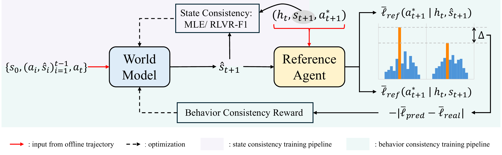

# BehR-WM: Behavior Consistency Reward for Text-Based World Models

<div align="center">

[](https://arxiv.org/abs/2604.13824)
[](LICENSE)
[](#release-timeline)
[](#release-timeline)

</div>

> Beyond surface-level state consistency — training text-based world models to
> preserve **agent behavior** rather than match every token.

<p align="center">
  
</p>

## Overview

**BehR-WM** reframes world-model training around **functional equivalence**: a
world model is a good simulator of the real environment if a frozen Reference
Agent cannot distinguish the two through its actions. Instead of maximizing
Exact Match between predicted and real states, we optimize a **Behavior
Consistency Reward (BehR)** that directly measures behavioral indistinguishability
and provides a dense per-step signal for GRPO training.

**Core insight.** Textual faithfulness is neither necessary nor sufficient for
agent-facing correctness: small surface omissions can derail the agent, while
large but decision-irrelevant differences leave behavior unchanged. BehR asks
the right question — *does the agent act the same?* — and turns the answer into
a tractable, gradient-friendly reward.

**Key task-level metric — Consistency Ratio (CR):**

$$CR = \frac{SR_{W2R}}{SR_{Real}}, \qquad CR_{pw} = \frac{|Real_{\checkmark} \cap W2R_{\checkmark}|}{|Real_{\checkmark}|}$$

where $SR_{W2R}$ is the success rate of replaying the agent's
world-model-generated action sequence in the real environment and $SR_{Real}$
is the agent's success rate in the real environment. $CR \to 1.0$ indicates
functional equivalence.

## Features

- **BehR reward** — drop-in GRPO reward for the [verl](https://github.com/volcengine/verl)
  framework, with WebShop (behavior + physical-facts) and TextWorld (pure behavior) variants.
- **3-metric evaluation suite** — Single-step EM, Task Success Rate
  (SR<sub>WM</sub> / SR<sub>W2R</sub> / SR<sub>Real</sub> / CR / CR<sub>pw</sub>),
  and step-level Behavior Consistency.
- **Two environments** — WebShop (e-commerce web navigation) and TextWorld
  (text adventure games).
- **Two backends** — OpenAI-compatible API agents and locally hosted vLLM agents,
  via a uniform agent interface.

## Release Timeline

This repository is released alongside the paper. Additional artifacts will
follow:

- ✅ **Code** — evaluation pipeline, BehR reward, verl training script.
- 🔜 **Model checkpoints** — trained BehR world models (coming soon).
- 🔜 **Datasets** — training trajectories and init contexts (coming soon).

Artifact links will be posted here and under
[`data/README.md`](data/README.md) once released.

## Repository Layout

```
behr-wm/
├── src/
│   ├── agents/              # ReAct agent implementation
│   ├── api/                 # OpenAI-compatible / vLLM client
│   ├── reward/              # BehR reward: behr_reward_webshop.py, behr_reward_textworld.py
│   ├── world_model/         # World model client interface
│   ├── data/                # Data preparation helpers
│   └── utils/               # Common utilities
├── eval/
│   ├── 01_single_step_accuracy/   # Metric 1: Exact Match
│   ├── 02_task_success_rate/      # Metric 2: SR_WM / SR_W2R / SR_Real / CR / CR_pw
│   └── 03_behavior_consistency/   # Metric 3: step-level BehR score
├── train/
│   └── run_grpo_4gpu.sh     # Minimal GRPO launcher (4 × A100 default)
├── scripts/
│   ├── env_setup/           # install_env.sh (base env + AgentGym), install_verl.sh
│   ├── servers/             # vLLM & WebShop server launchers
│   └── download_data.py     # Fetch train-split init contexts from HF (coming soon)
├── configs/                 # Eval and training config templates
├── data/
│   └── init_contexts/       # Shipped test splits (WebShop + TextWorld)
├── docs/                    # INSTALL / EVALUATION / TRAINING
├── assets/                  # Figures used in README / docs
├── compute_cr.py            # Batch CR / CR_pw aggregator
└── AgentGym/                # Cloned automatically by install_env.sh (gitignored)
```

## Quick Start — Evaluation

### 1. Install

Requirements: Linux, Python 3.10, CUDA 12.6 (or compatible), ≥ 1× A100-80GB for
evaluation (≥ 4× A100-80GB recommended for training).

```bash
git clone https://github.com/Ricardo-H/behr-wm.git
cd behr-wm

# One-shot environment installer: creates .venv, installs PyTorch + vLLM +
# Flash Attention, clones AgentGym, installs the WebShop backend.
bash scripts/env_setup/install_env.sh
source .venv/bin/activate
```

The test-split init contexts needed for evaluation are already bundled in
`data/init_contexts/` — no extra download is required.

See [docs/INSTALL.md](docs/INSTALL.md) for troubleshooting.

### 2. Start servers

```bash
# World model under test
bash scripts/servers/start_wm_server.sh -m <wm_model_path> -p 8001 -gpu 0

# WebShop backend
bash scripts/servers/start_webshop_env.sh 36001

# Reference Agent (required for Metric 3 / training)
bash scripts/servers/start_reference_agent_server.sh -m Qwen/Qwen3-8B -p 8000 -gpu 1
```

### 3. Run the 3-stage evaluation

```bash
# Metric 1 — Single-step Exact Match
bash eval/01_single_step_accuracy/run.sh webshop <model_name> outputs/

# Metric 2 — Task Success Rate & Consistency Ratio
bash eval/02_task_success_rate/run_wm.sh        # agent rolls out inside the WM
bash eval/02_task_success_rate/run_wm2real.sh outputs/task_success_rate/wm/webshop/
bash eval/02_task_success_rate/run_real.sh     # real-env baseline
python eval/02_task_success_rate/analyze_pairwise_cr.py \
    --real-dir outputs/task_success_rate/real/webshop/<exp> \
    --w2r-dir  outputs/task_success_rate/w2r/webshop/<exp>

# Metric 3 — Step-level Behavior Consistency
bash eval/03_behavior_consistency/run_eval_bf.sh
```

Full details and TextWorld variants live in [docs/EVALUATION.md](docs/EVALUATION.md).

## Training

A minimal training launcher is provided at
[`train/run_grpo_4gpu.sh`](train/run_grpo_4gpu.sh) (4× A100-80GB default). It
wires our BehR reward into the [verl](https://github.com/volcengine/verl) GRPO
trainer. The full list of hyper-parameters and the 8-GPU / TextWorld variants
are documented in [docs/TRAINING.md](docs/TRAINING.md).

```bash
# 1. Start the Reference Agent (judge) server
bash scripts/servers/start_reference_agent_server.sh -m Qwen/Qwen3-8B -p 8000 -gpu 0,1,2,3 --shared

# 2. Launch GRPO training (edit TRAIN_DATA / VAL_DATA / WORLD_MODEL inside the script)
bash train/run_grpo_4gpu.sh
```

### Reward plug-in

verl's `custom_reward_function` points at one of:

- [`src/reward/behr_reward_webshop.py`](src/reward/behr_reward_webshop.py) —
  BehR + physical-facts reward for WebShop
- [`src/reward/behr_reward_textworld.py`](src/reward/behr_reward_textworld.py) —
  pure BehR for TextWorld

Both expose `compute_score(data_source, solution_str, ground_truth, extra_info)`.

### Key training hyper-parameters (GRPO, verl, 4× A100)

| Group | Parameter | Value |
|-------|-----------|-------|
| Algorithm | `algorithm.adv_estimator` | `grpo` |
| Algorithm | KL loss coefficient | `0.001` |
| Data | `data.train_batch_size` | `32` |
| Data | `data.max_prompt_length` | `14336` |
| Data | `data.max_response_length` | `1024` |
| Optim | learning rate (actor) | `5e-6` |
| Rollout | `tensor_model_parallel_size` | `2` |
| Rollout | `n` (group size) | `5` |
| Rollout | `temperature` / `top_p` | `1.3` / `1.0` |
| Reward | reward mode | `cauchy` (recommended) |
| Reward | `behavior_weight` / `facts_weight` | `0.8` / `0.2` (WebShop) |
| Reward | `behavior_scale_coef` ($\alpha$) | `1.0` |
| Hardware | world size | 4× A100-80GB |

A ready-to-edit config template also lives at
[`configs/train_config.yaml`](configs/train_config.yaml).

## The BehR Reward

BehR measures how much a frozen Reference Agent's likelihood of the logged next
action shifts between the real state $s_{\text{real}}$ and the world-model-predicted
state $s_{\text{pred}}$:

$$\Delta = \frac{1}{N}\sum_{i=1}^{N}\log\pi_\theta(a_i\mid s_{\text{pred}}) - \frac{1}{N}\sum_{i=1}^{N}\log\pi_\theta(a_i\mid s_{\text{real}})$$

$$R_{\text{BehR}}^{\text{cauchy}} = \frac{1}{1 + \alpha \cdot |\Delta|}$$

We use **mean** (not sum) log-probability to remove length bias, and a
**Cauchy**-shaped transform to keep the reward in $(0, 1]$ with non-vanishing
gradients even for large $|\Delta|$. For WebShop we additionally add a small
physical-facts term (weight 0.2) that grounds predicted states in ASIN / price /
page / rating mentions from the real env.

## Evaluation Metrics at a Glance

| Metric | What it measures | Where |
|--------|------------------|-------|
| EM | Single-step token-level match | `eval/01_single_step_accuracy/` |
| SR<sub>WM</sub> | Agent success rolling out inside the WM | `eval/02_task_success_rate/run_wm.sh` |
| SR<sub>W2R</sub> | WM-generated action replay in real env | `eval/02_task_success_rate/run_wm2real.sh` |
| SR<sub>Real</sub> | Agent success in real env (baseline) | `eval/02_task_success_rate/run_real.sh` |
| CR | SR<sub>W2R</sub> / SR<sub>Real</sub> | `analyze_pairwise_cr.py`, `compute_cr.py` |
| CR<sub>pw</sub> | Pairwise overlap of successful tasks | `analyze_pairwise_cr.py` |
| BehR | Mean-log-prob shift under Reference Agent | `eval/03_behavior_consistency/` |

## Data

- **WebShop** ([Yao et al., 2022](https://arxiv.org/abs/2207.01206)) — e-commerce web navigation.
- **TextWorld** ([Côté et al., 2019](https://arxiv.org/abs/1806.11532)) — text-based adventure games.
- Evaluation uses 200 standardized test tasks from [AgentGym](https://github.com/WooooDyy/AgentGym)
  per environment; trajectory datasets are produced by our reference agent against a frozen real env.

Init contexts, trajectory datasets, and trained world-model checkpoints are
served from HuggingFace Hub via `scripts/download_data.py`. Links appear under
[Release Timeline](#release-timeline) as each artifact ships.

## Documentation

- [Installation guide](docs/INSTALL.md)
- [Evaluation guide](docs/EVALUATION.md)
- [Training guide](docs/TRAINING.md)

## Citation

```bibtex
@article{huang2026behrwm,
  title   = {Beyond State Consistency: Behavior Consistency in Text-Based World Models},
  author  = {Huang, Youling and Chen, Guanqiao and Yao, Junchi and Wang, Lu and
             Yang, Fangkai and Du, Chao and Zhao, ChenZhuo and Zhao, Pu and
             Lin, Qingwei and Rajmohan, Saravan and Zhang, Dongmei},
  journal = {arXiv preprint arXiv:2604.13824},
  year    = {2026},
  url     = {https://arxiv.org/abs/2604.13824}
}
```

## License

Code is released under the Apache License 2.0 — see [LICENSE](LICENSE).
WebShop, TextWorld, and AgentGym assets retain their upstream licenses.

## Acknowledgments

BehR-WM builds on [verl](https://github.com/volcengine/verl) (GRPO training
framework), [vLLM](https://github.com/vllm-project/vllm) (high-throughput
inference), [WebShop](https://github.com/princeton-nlp/webshop), and
[TextWorld](https://github.com/microsoft/TextWorld). We thank the authors of
these projects.
